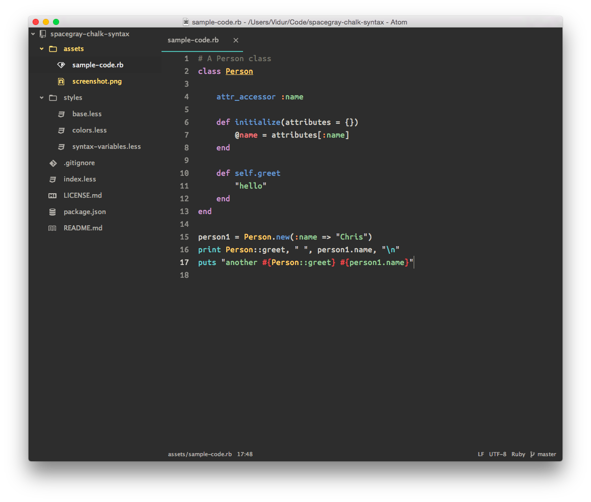

# Spacegray Chalk Atom syntax theme

A fork of [kkga](https://github.com/kkga)'s [Spacegray Eighties](https://github.com/kkga/spacegray) Atom syntax theme that uses a slightly different color palette.

The UI Theme in this screenshot is [Atom Material](https://atom.io/themes/atom-material-ui) and the typeface is [Ubunut Mono](http://font.ubuntu.com)
